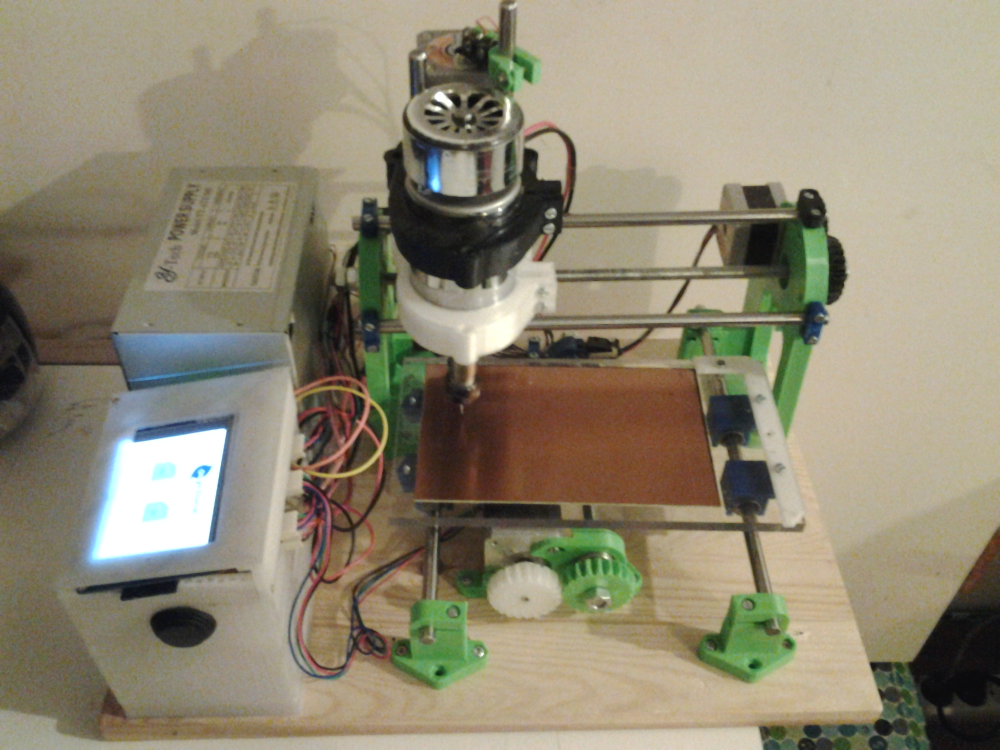

# CNC
this is a project based on Cyclone PCB Factory https://github.com/carlosgs/Cyclone-PCB-Factory
Changed the hardware (MSP430) & Software. Add a 3.2"TFT User Interface and SD card in order to be independet from PC.
Still a lot to do. This is the first version and there are still some things to change in software.
You can find more information here:
http://e-homelab.flyvotech.com/index.php/2015/10/07/cnc-milling-machine/

